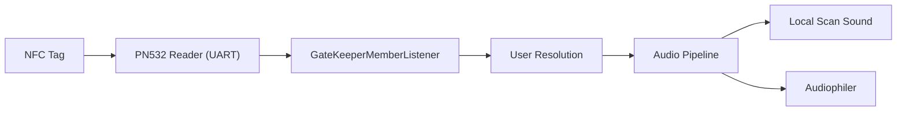
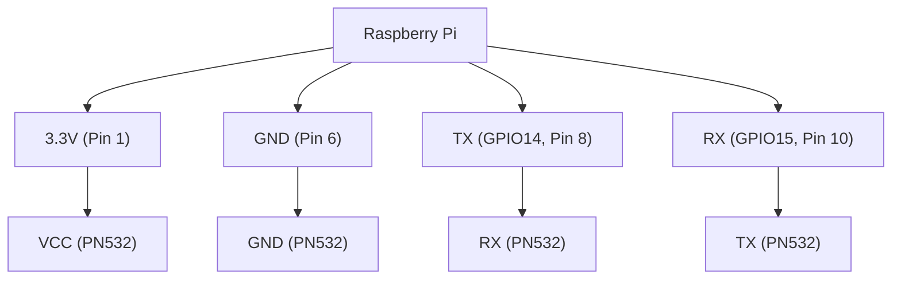

# Harold-NFC
A NFC system that scans tags, identifies user via GateKeeper, and plays personalized audio through Audiophiler.


## Dependencies

1. FFmpeg (for audio playback)
2. libnfc (NFC communication)
3. An environment file containing the Gatekeeper credentials.

## Systemd Setup

Harold NFC can be run as a background service using `systemd`.
```
[Unit]
Description=Harold NFC
After=network-online.target sound.target
Wants=network-online.target
[Service]
Type=simple
User=pi
WorkingDirectory=/home/pi/gatekeeper/harold-nfc
EnvironmentFile=/home/pi/gatekeeper/harold-nfc/.env
ExecStart=/home/pi/gatekeeper/harold-nfc/target/release/harold-nfc

Restart=always
RestartSec=5

[Install]
WantedBy=multi-user.target
```

## GPIOs


